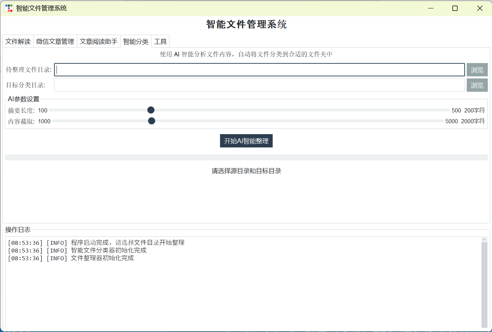
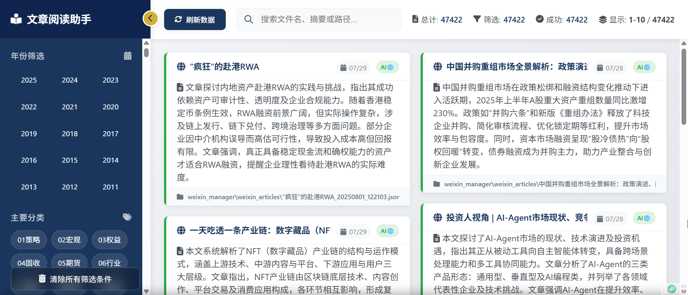
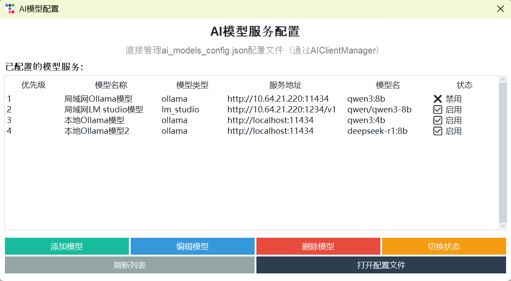

# TidyFile - 智能文件整理与解读系统

[](https://www.python.org/downloads/)
[](LICENSE)
[](https://github.com/vincentrcl000/TidyFile)

基于AI的智能文件整理和解读系统，让文件管理、阅读变得简单高效。




## 🎯 适用场景

- **📁 文件整理**：自动分类大量文件
- **📖 内容摘要**：批量生成文件内容摘要，快速了解文档要点
- **📱 移动阅读**：通过手机、平板访问和阅读文件
- **🔄 重复清理**：智能检测和清理重复文件，节省存储空间
- **📋 标签管理**：支持文件标签体系，提升查找效率

## 🚀 快速开始

### 方式一：下载可执行文件（推荐）

1. **下载安装包**
   - 访问 [GitHub Actions](https://github.com/vincentrcl000/TidyFile/actions) 或 [GitHub Releases](https://github.com/vincentrcl000/TidyFile/releases)
   - 下载 Windows 版本：
     - `TidyFile-Windows-x64.exe` - 主程序（便携版）
     - `TidyFile-Windows-x64.zip` - 压缩包版本
     - `TidyFile-Windows-Installer.zip` - 完整安装包（推荐）

2. **运行程序**
   - 便携版：双击 `.exe` 文件直接运行
   - 安装包：解压后运行 `create_desktop_shortcuts.py` 创建桌面快捷方式

### 方式二：源代码安装

```bash
# 克隆项目
git clone https://github.com/vincentrcl000/TidyFile.git
cd TidyFile

# 安装依赖
pip install -r requirements.txt

# 启动应用
python main.py
```

### 配置AI模型

```bash
# 安装Ollama (推荐)
# 下载地址: https://ollama.ai/

# 下载模型
# 普通配置电脑
ollama run qwen3:0.6b
# 带GPU电脑
ollama run qwen3:8b
# 如果局域网中有更强大算力服务和更强大的模型服务，质量、速度表现将更佳
# 在线模型（如DeepSeek、OpenAI等）也可以使用，但请注意tokens成本
```

在工具-AI模型配置中添加模型服务

示例：


## 🌟 核心功能

- **🤖 AI智能分类**：基于内容自动分类文件到整理好的树形目录中，同时生成文章摘要、标签
- **📊 文章解读**：文章解读对选择的文件目录中所有文件调用AI生成摘要、标签，可在工具中启用多任务/多线程来支持大量文章并发处理
- **📱 文章阅读助手和移动访问**：启用文章阅读助手将开启Web界面访问文章摘要、标签，直接在浏览器直接打开文章，支持手机平板
- **🌍 多语言**：支持中文、英文
- **🔄 便携模式**：无需安装，即插即用
- **📋 数据安全**：任务开始前会备份数据/保留原数据，完整记录操作过程，支持回滚

## 📋 技术栈

- **后端**：Python 3.8+
- **AI模型**：本地、局域网、OpenAI兼容模型
- **GUI框架**：ttkbootstrap
- **文件处理**：PyPDF2, python-docx, Pillow
- **网络服务**：Flask
- **平台支持**：Windows 10/11

## 📖 使用指南

### 基本操作流程

1. **启动程序**：运行 `python main.py`
2. **选择功能**：AI智能分类、文件解读、重复清理等
3. **配置参数**：设置源文件夹、目标文件夹、处理参数
4. **开始处理**：AI自动分析并执行相应操作
5. **查看结果**：通过文章阅读助手或直接查看文件

### 移动端使用

1. **启动服务器**：在主程序运行文章阅读助手，如果采用的是安装包安装，会在桌面生成文章阅读助手单独启动的快捷方式，无需从主程序启动
2. **获取地址**：从主程序运行文章阅读助手会提示局域网访问地址
3. **手机访问**：在pad、手机浏览器中输入地址
4. **浏览文件**：支持搜索、筛选、直接打开文件

### 微信文章管理功能使用说明

- **依赖**：该功能需要先使用chatlog来获取微信里藏的文章，再调用AI来进行下载到本地、生成摘要，合并到文章阅读助手和本地文章一样查看。
- **操作步骤**：
  1. **微信版本要求**：下载安装微信电脑版4.0.3版本，关闭自动更新。因为chatlog已不再更新，它并不支持最新版微信
  2. **下载并开启chatlog**：到[点这里跳转](https://github.com/sjzar/chatlog) 下载软件，按照其指引启用，直到前四项功能都启用成功
  3. **备份收藏的文章链接**：后在TidyFile-微信文章管理中，输入收藏文章的账号名（支持微信号、别名、昵称、备注名等）和时间区间，点击收藏文章备份，正确获取收藏的文章链接后，后续的操作不再依赖微信和chatlog，都可以关闭
  4. **备份文章解读**：启动备份文章解读，TidyFile将下载对应的文章内容、调用AI生成摘要和本地静态HTML页面，支持点击文章标题打开在线链接，或者离线情况点击路径打开本地静态页面来查看文章
  5. **关于微信收藏的文件**：微信传输的文件附件会不加密直接存在电脑上，所以无需用到chatlog，只需要使用智能文件分类功能，将源文件目录选择到微信文件附件默认存储位置（通常在C:\Users\<你的用户名>\Documents\xwechat_files\<微信号或wxid_xxxxxxx>\msg\file），目标文件目录选择你已经整理好的文件目录，即可根据文件内容智能迁移到对应的目录中
  6. **安全性说明**：TidyFile、chatlog完全本地化运行，理论上无风险，请保障在安全的系统环境中使用

## 📚 更多文档

- **[详细帮助文档](docs/详细帮助文档.md)** - 完整的技术文档
- **[用户手册](docs/用户手册.md)** - 用户使用指南
- **[项目结构](docs/PROJECT_STRUCTURE.md)** - 代码架构说明
- **[版本发布](docs/Releases.md)** - 版本更新记录
- **[构建指南](docs/BUILD_GUIDE.md)** - 如何获取exe文件
- **[GUI修复记录](docs/GUI_FIXES.md)** - GUI问题修复详情
- **[贡献指南](CONTRIBUTING.md)** - 参与项目开发

## ⚠️ 免责申明

- 本项目用于个人学习研究使用，所有代码使用AI生成，相关风险请自行评估

欢迎提交 Issue 和 Pull Request！

## 📄 许可证

MIT License

---

**版本**：1.0.0  
**更新时间**：2025-08-05
